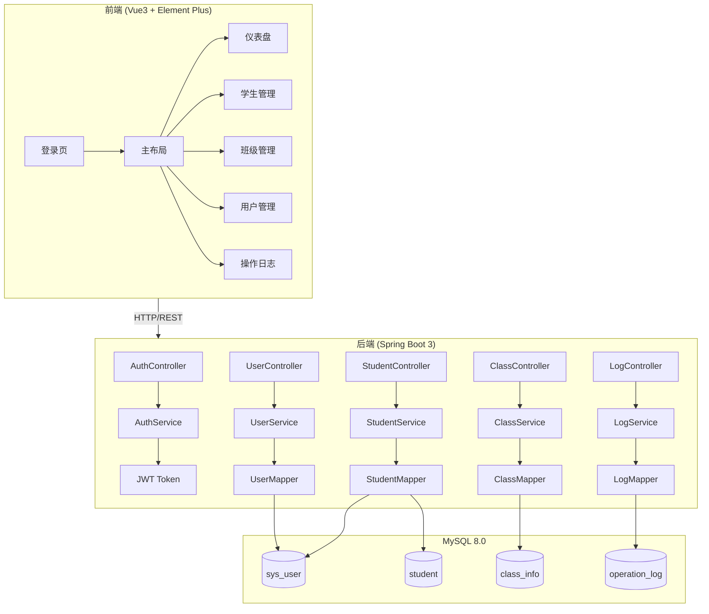
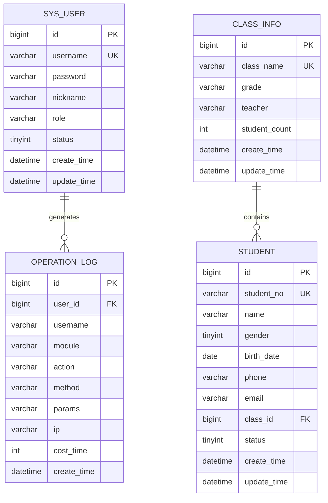

# 学生管理系统 - 项目设计文档

## 1. 系统架构

## 2. ER 图

## 3. 接口清单

### AuthController - 认证模块

| Method | Path             | Description      |
| ------ | ---------------- | ---------------- |
| POST   | /api/auth/login  | 用户登录         |
| POST   | /api/auth/logout | 用户登出         |
| GET    | /api/auth/info   | 获取当前用户信息 |

### StudentController - 学生管理

| Method | Path               | Description      |
| ------ | ------------------ | ---------------- |
| GET    | /api/students      | 分页查询学生列表 |
| GET    | /api/students/{id} | 获取学生详情     |
| POST   | /api/students      | 新增学生         |
| PUT    | /api/students/{id} | 更新学生信息     |
| DELETE | /api/students/{id} | 删除学生         |

### ClassController - 班级管理

| Method | Path              | Description        |
| ------ | ----------------- | ------------------ |
| GET    | /api/classes      | 分页查询班级列表   |
| GET    | /api/classes/all  | 获取所有班级(下拉) |
| POST   | /api/classes      | 新增班级           |
| PUT    | /api/classes/{id} | 更新班级           |
| DELETE | /api/classes/{id} | 删除班级           |

### UserController - 用户管理

| Method | Path                   | Description      |
| ------ | ---------------------- | ---------------- |
| GET    | /api/users             | 分页查询用户列表 |
| POST   | /api/users             | 新增用户         |
| PUT    | /api/users/{id}        | 更新用户         |
| DELETE | /api/users/{id}        | 删除用户         |
| PUT    | /api/users/{id}/status | 修改用户状态     |

### LogController - 操作日志

| Method | Path      | Description      |
| ------ | --------- | ---------------- |
| GET    | /api/logs | 分页查询操作日志 |

## 4. UI/UX 规范

### 色彩系统

- 主色调: `#409EFF` (Element Plus 默认蓝)
- 成功色: `#67C23A`
- 警告色: `#E6A23C`
- 危险色: `#F56C6C`
- 信息色: `#909399`
- 背景色: `#F5F7FA`
- 卡片背景: `#FFFFFF`

### 字体规范

- 主字体: `-apple-system, BlinkMacSystemFont, 'Segoe UI', Roboto, 'Helvetica Neue', Arial`
- 标题字号: 20px / 18px / 16px
- 正文字号: 14px
- 辅助字号: 12px

### 间距规范

- 页面边距: 24px
- 卡片内边距: 20px
- 元素间距: 16px
- 紧凑间距: 8px

### 圆角规范

- 卡片圆角: 8px
- 按钮圆角: 4px
- 输入框圆角: 4px

### 阴影规范

- 卡片阴影: `0 2px 12px 0 rgba(0, 0, 0, 0.1)`
